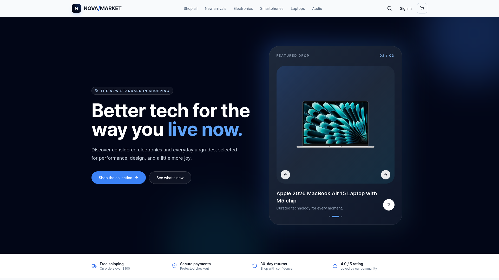
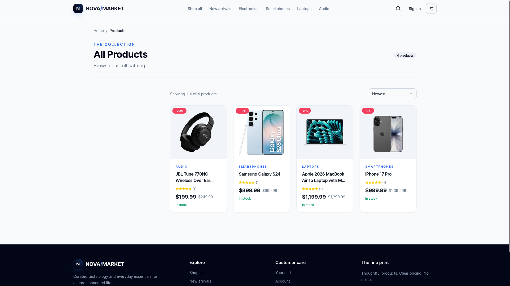
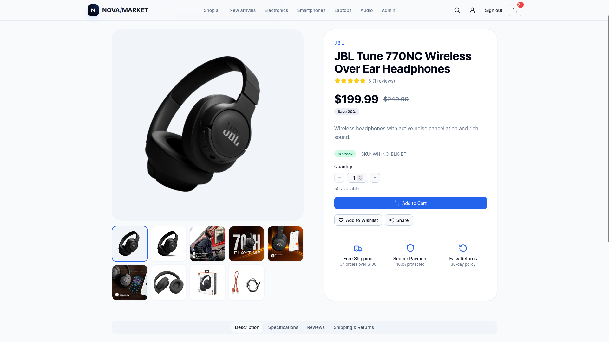
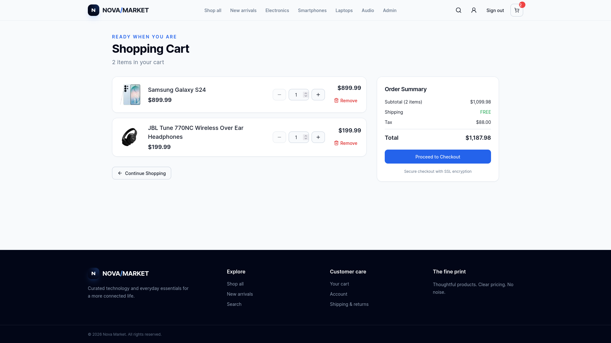
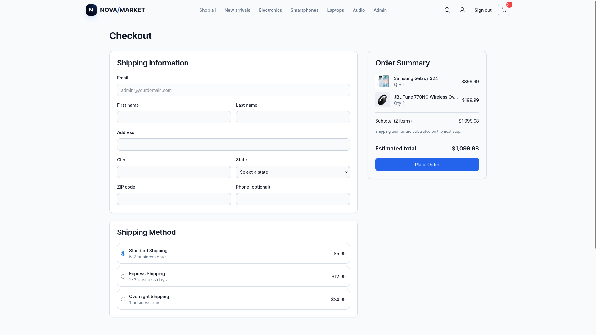
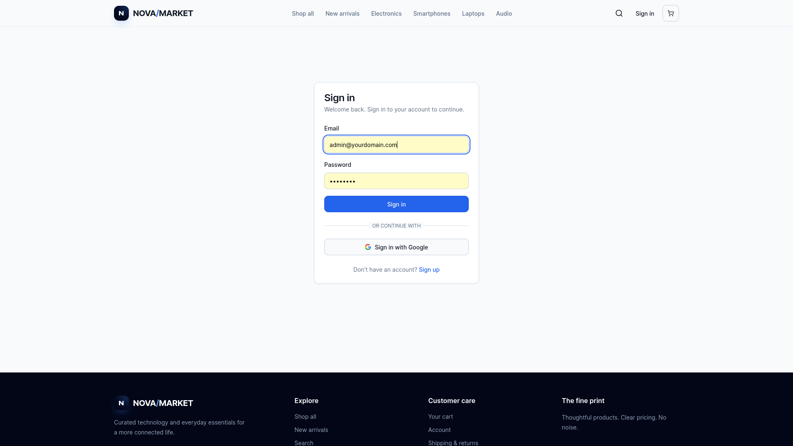
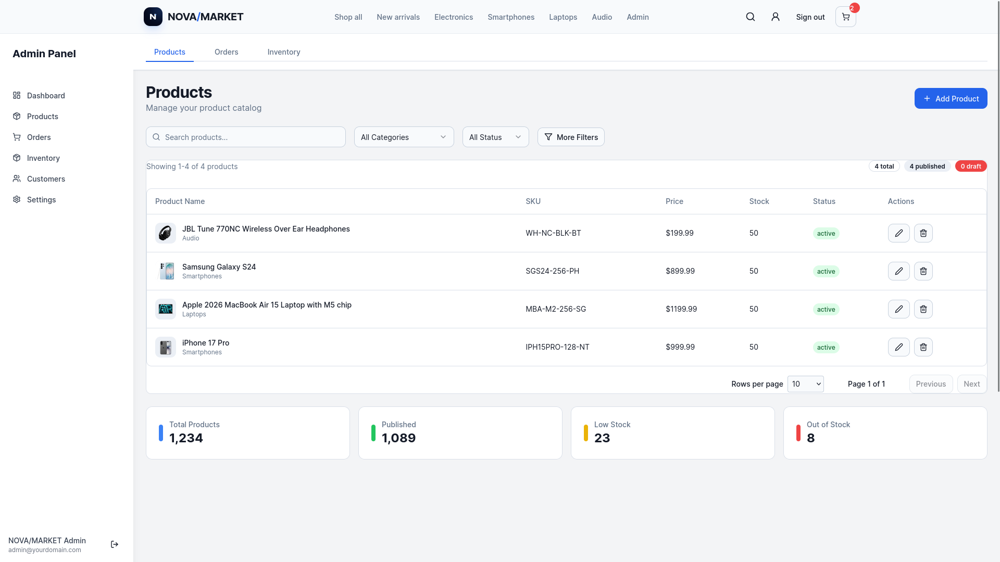
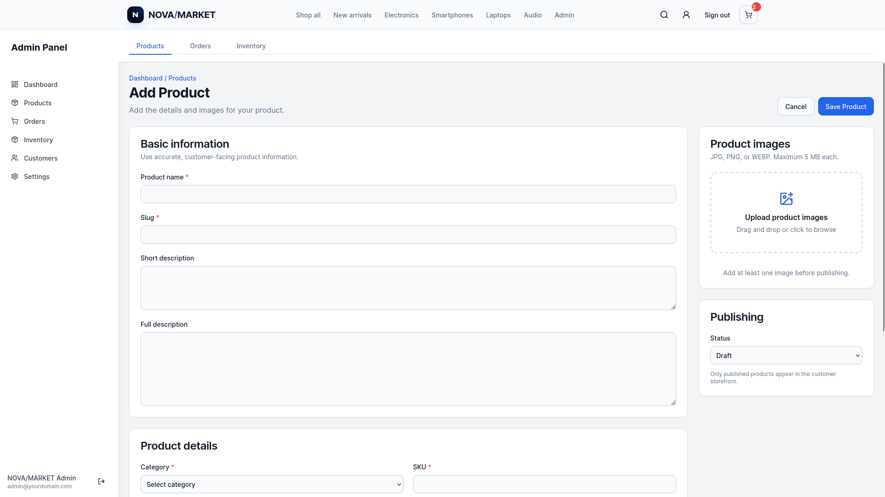
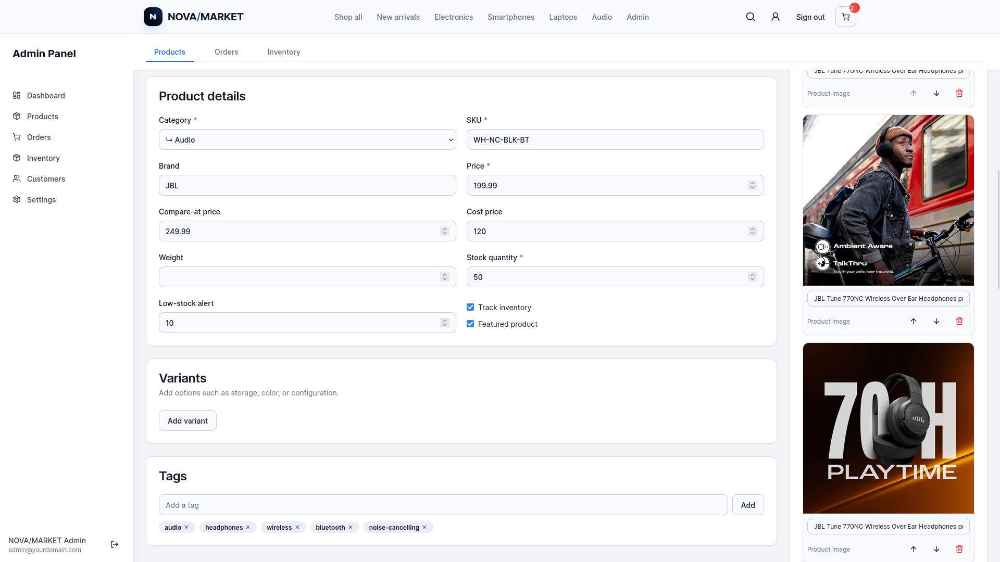

# NOVA/MARKET

> A full-stack technology e-commerce platform built with Next.js, TypeScript, Prisma, PostgreSQL, and Neon.

NOVA/MARKET is a database-driven e-commerce application focused on consumer technology products such as smartphones, laptops, and audio devices.

The project demonstrates full-stack software engineering across the customer storefront, server-side application layer, relational database, authentication and authorization, product management, inventory, reviews, cart and order workflows, product image management, caching, testing, and deployment.

---

## 🚀 Demo

**Live Demo:**  
https://nova-market-omega.vercel.app

**GitHub:**  
https://github.com/udaysinghparihar007/NOVA-MARKET

---

## 📸 Preview

### Storefront



### Product Catalog



### Product Details



### Shopping Cart



### Checkout



### Authentication



### Admin Dashboard



### Admin Product Management



### Product Editor



---

# ✨ Features

## 🛍️ Storefront

- Technology-focused product catalog
- Responsive product grid
- Product detail pages
- Hierarchical category navigation
- Product search
- Sorting
- Price filtering
- Pagination
- Product image galleries
- Multiple product images
- Product variants
- Inventory-aware availability
- Reviews and ratings
- SEO metadata
- Responsive design
- Loading states
- Empty states
- Error handling

---

## 🛒 Commerce

- Persistent shopping cart
- Cart item management
- Order creation
- Order history
- Inventory tracking
- Stock-aware purchasing
- Product availability checks
- Order lifecycle management
- Stripe checkout integration
- Stripe webhook handling
- Server-side product and inventory validation

---

# 🔐 Authentication & Authorization

NOVA/MARKET includes authentication and role-based access control.

### Customer Features

- User authentication
- Protected account pages
- Customer order history
- Cart management
- Review functionality

### Administration

- Role-based admin access
- Protected administration routes
- Server-side authorization checks
- Admin-only product management
- Protected product creation and editing
- Protected product deletion

---

# 🧑‍💼 Administration

NOVA/MARKET includes a dedicated administration workflow for managing the technology catalog.

## Product Management

Admins can:

- View products
- Search products
- Filter products
- Create products
- Edit products
- Delete products
- Publish and unpublish products
- Mark products as featured
- Manage pricing
- Manage inventory
- Manage low-stock thresholds
- Manage categories
- Manage brands
- Manage SKUs
- Manage variants
- Manage tags
- Manage descriptions
- Manage product status

---

## Product Editor

The product editor provides a responsive two-column administration interface.

It supports:

- Product name
- Automatic slug generation
- Manual slug editing
- Short description
- Full description
- Category selection
- Brand
- SKU
- Price
- Compare-at price
- Cost price
- Stock quantity
- Low-stock threshold
- Inventory tracking
- Product variants
- Product tags
- Publishing status
- Featured product controls

---

# 🖼️ Product Image Management

Admins can manage multiple images for every product.

Features include:

- Multiple image upload
- JPG/PNG/WEBP validation
- 5 MB per-image limit
- Drag-and-drop upload
- Image previews
- Image ordering
- Image deletion
- Alt-text editing
- Primary image selection
- Existing image preservation during edits
- Safe cleanup of unused image files

The first ordered product image is used as the primary product image across the storefront.

---

# 🖼️ Product Image Gallery

Customer-facing product pages include a complete product image gallery.

The gallery provides:

- Primary product image
- Thumbnail navigation
- Multiple product images
- Accessible image controls
- Image switching
- Product-specific image ordering

### Image Flow

```text
Admin uploads product images
            ↓
     ProductImage records
            ↓
    Image position/order
            ↓
      Primary image
            ↓
     Product detail page
            ↓
 Product cards and catalog